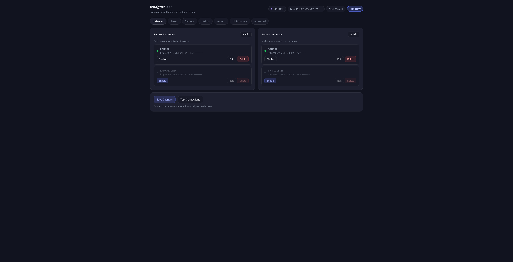
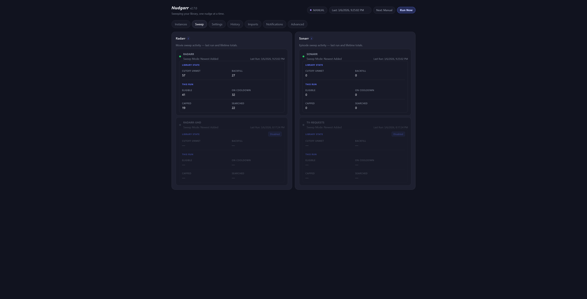
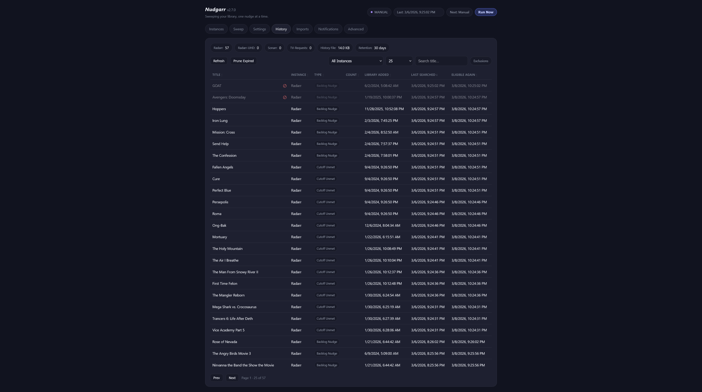
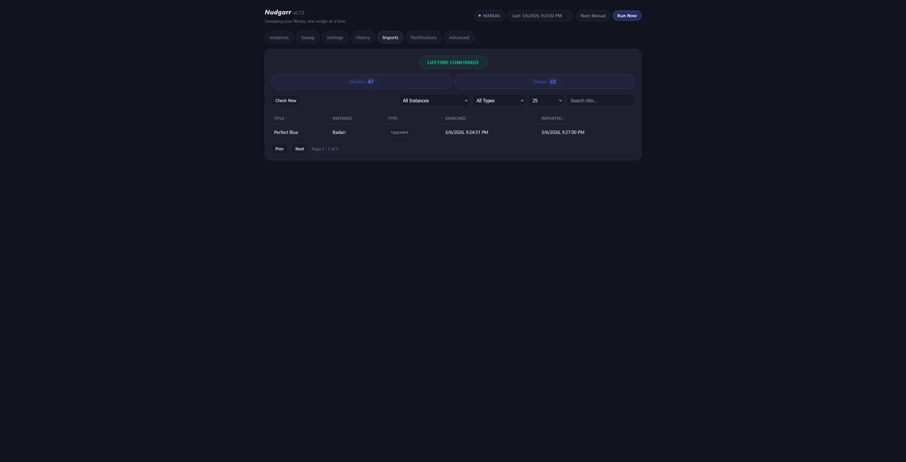
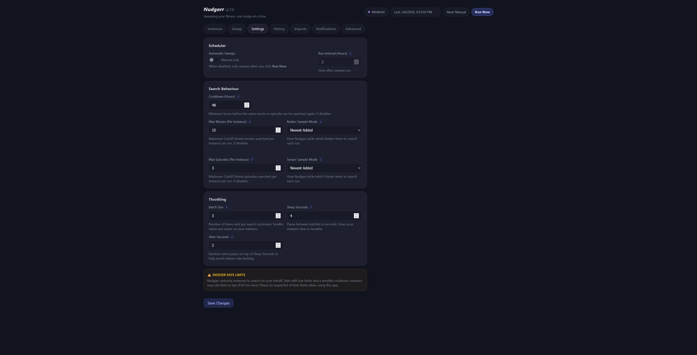
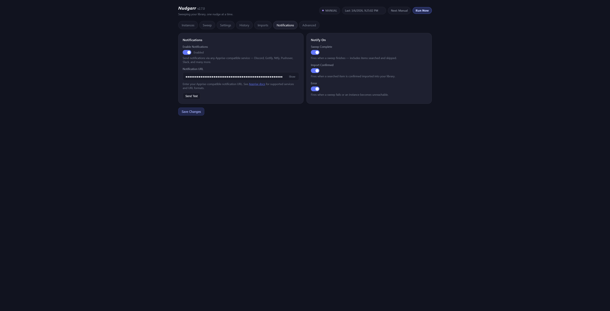
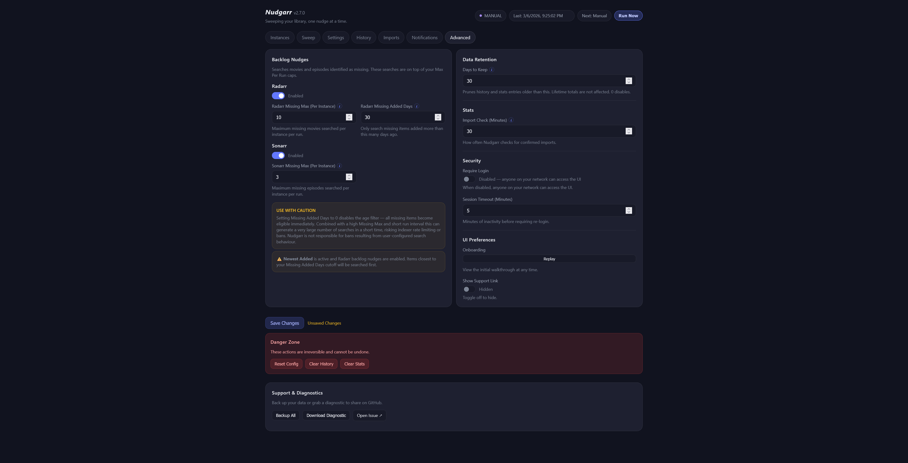
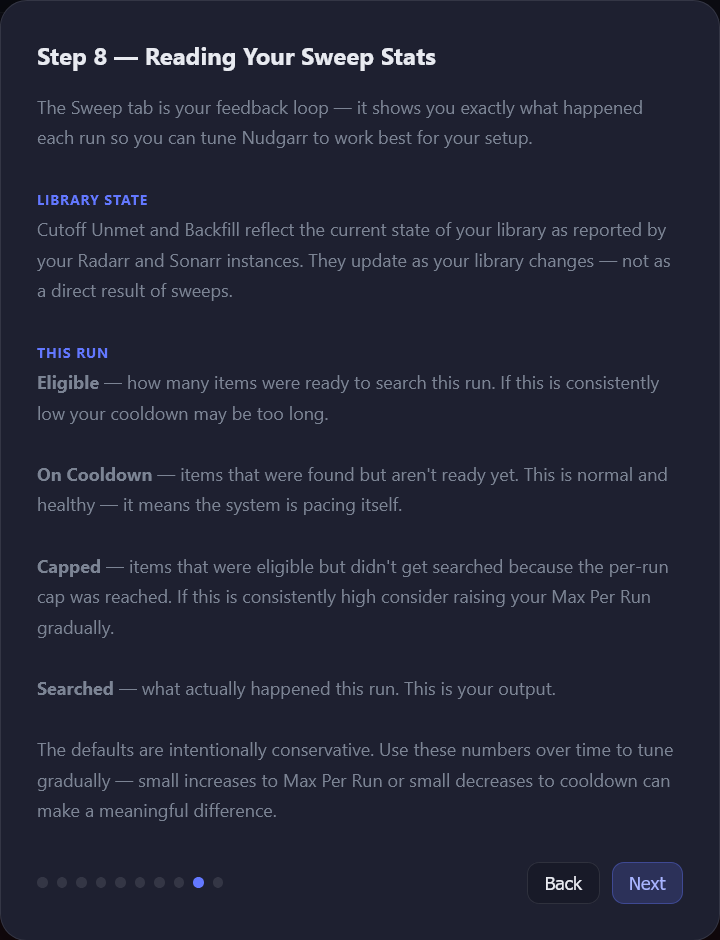

# Nudgarr
### Because RSS sometimes needs a nudge.

Nudgarr keeps your Radarr and Sonarr libraries improving automatically — scheduling searches for missing content and quality upgrades so you don't have to.

---

## Screenshots

Click any screenshot to view full size.

<table>
  <tr>
    <td align="center"><a href="docs/screenshots/instances.png"></a><br/><sub>Instances</sub></td>
    <td align="center"><a href="docs/screenshots/sweep.png"></a><br/><sub>Sweep</sub></td>
  </tr>
  <tr>
    <td align="center"><a href="docs/screenshots/history.png"></a><br/><sub>History</sub></td>
    <td align="center"><a href="docs/screenshots/imports.png"></a><br/><sub>Imports</sub></td>
  </tr>
  <tr>
    <td align="center"><a href="docs/screenshots/settings.png"></a><br/><sub>Settings</sub></td>
    <td align="center"><a href="docs/screenshots/notifications.png"></a><br/><sub>Notifications</sub></td>
  </tr>
  <tr>
    <td align="center"><a href="docs/screenshots/advanced.png"></a><br/><sub>Advanced</sub></td>
    <td align="center"><a href="docs/screenshots/onboard.png"></a><br/><sub>Onboarding</sub></td>
  </tr>
</table>

---

## What it does

- **Cutoff Unmet sweeps** — finds items in Radarr and Sonarr's Wanted → Cutoff Unmet queue and triggers a search for a better quality version
- **Backlog Nudges** — searches missing movies and episodes that have never been grabbed, with age filtering and per-app caps
- **Import tracking** — polls Radarr and Sonarr after each sweep to confirm which searches resulted in a successful download
- **Multiple instances** — supports multiple Radarr and Sonarr instances independently, each with their own health status

---

## Features

**Core behaviour**
- Scheduler with configurable run interval, or manual-only mode
- Per-instance enable/disable — disabled instances skipped in sweeps and health checks
- Per-app sample modes — Random, Alphabetical, Oldest Added, Newest Added independently for Radarr and Sonarr
- Configurable cooldown to avoid hammering indexers between runs
- Batch size, sleep, and jitter controls for indexer rate limit compliance
- One retry per instance per sweep before marking bad and continuing
- Per-app Backlog Nudge toggles with Missing Added Days age filter and per-instance caps

**UI & history**
- Web UI with Instances, Sweep, Settings, History, Imports, Notifications, and Advanced tabs
- Sweep tab — per-instance Library State (Cutoff Unmet, Backfill) and This Run stats (Eligible, On Cooldown, Capped, Searched) updated after every sweep
- Search history with sweep type, instance, library added date, search count, sortable columns, title search, and pagination
- Exclusion list — exclude specific titles from future searches via the ⊘ icon in History
- Confirmed import tracking with lifetime Movies/Shows totals, type filtering, and title search
- Apprise notifications — sweep complete, import confirmed, and error triggers per instance
- Instance health dots — live status updated on every sweep, test connection, and page load
- First-run onboarding walkthrough — 10-step guided setup before the first sweep runs
- What's New modal — shown once per version upgrade, never on fresh install
- Backup All — single download of config, state, and stats as a zip

**Security & operations**
- UI login with PBKDF2-HMAC-SHA256 password hashing and configurable session timeout
- Progressive brute force lockout — 3 failures → 30s, up to 1hr at 15+ failures
- Non-root container execution via PUID/PGID with su-exec privilege drop
- Read-only container filesystem with restricted tmpfs at `/tmp`
- `cap_drop: ALL` with only CHOWN, SETUID, SETGID added back
- Resource limits — 128MB RAM, 0.5 CPU, 50 PIDs
- Multi-arch Docker images — `linux/amd64` and `linux/arm64`

---

## Quick start

Images are available on **Docker Hub** and **GitHub Container Registry (GHCR)**.

| Registry | Image |
|----------|-------|
| Docker Hub | `mmagtech/nudgarr:latest` |
| GHCR | `ghcr.io/mmagtech/nudgarr:latest` |

**Tags:** `latest` · `dev` · `v2.7.0` · `2.7.0` · `2.7`

1. Copy `.env.example` to `.env` and fill in your values
2. Run `docker compose up -d`
3. Open `http://<your-host>:8085`

```env
PUID=1000
PGID=1000
PORT=8085
CONFIG_PATH=/your/path/to/appdata/nudgarr
```

```yaml
version: "3.8"
services:
  nudgarr:
    image: mmagtech/nudgarr:latest
    container_name: nudgarr
    restart: unless-stopped
    ports:
      - "${PORT:-8085}:${PORT:-8085}"
    volumes:
      - ${CONFIG_PATH:-./config}:/config
    environment:
      - PUID=${PUID:-1000}
      - PGID=${PGID:-1000}
      - PORT=${PORT:-8085}
      - CONFIG_FILE=/config/nudgarr-config.json
      - STATE_FILE=/config/nudgarr-state.json
      - STATS_FILE=/config/nudgarr-stats.json
    read_only: true
    tmpfs:
      - /tmp:rw,noexec,nosuid,nodev,size=64m
    tty: false
    stdin_open: false
    security_opt:
      - no-new-privileges:true
    cap_drop:
      - ALL
    cap_add:
      - CHOWN
      - SETUID
      - SETGID
    pids_limit: 50
    mem_limit: 128m
    cpus: 0.5
    logging:
      driver: json-file
      options:
        max-size: "10m"
        max-file: "3"
```

---

## PUID / PGID

Nudgarr runs as the user you specify — no permission issues with your `/config` volume.

| Platform | Typical values |
|----------|---------------|
| Unraid | `PUID=99` `PGID=100` (nobody:users) |
| Linux | `PUID=1000` `PGID=1000` |
| Synology | Match your DSM user — check with `id` over SSH |

Defaults to `1000:1000` if not set. Supported on any host running Docker — Unraid, Synology, TrueNAS SCALE, CasaOS, Portainer, or a plain Linux server.

---

## Config files

| File | Purpose |
|------|---------|
| `/config/nudgarr-config.json` | All settings |
| `/config/nudgarr-state.json` | Search history and cooldowns |
| `/config/nudgarr-stats.json` | Confirmed import records |

---

## Security

Nudgarr is a local network tool. Understanding what it does and doesn't protect is important before deploying it.

**What the built-in login does**
The login screen prevents someone on your network from accessing the UI and changing your configuration. It is not a hardened security layer — it is basic access control for your local network. Passwords are stored using PBKDF2-HMAC-SHA256 with a unique random salt. Failed login attempts trigger a progressive lockout. Timing-safe comparison is used throughout.

**What it does not protect**
- Radarr and Sonarr API keys are stored in plaintext in the config file
- Credentials are sent over plain HTTP unless behind a reverse proxy with HTTPS
- SSH or physical access to your server bypasses all of this regardless

**Recommendations**
- Run on your LAN only — do not expose port 8085 to the internet
- For remote access use a VPN (Tailscale, WireGuard) or a reverse proxy with HTTPS
- Enable the built-in login as a basic layer of protection on your local network

Nudgarr intentionally avoids features that introduce unnecessary attack surface. It does not execute arbitrary code, does not accept external input beyond its own UI, and does not make inbound connections — all outbound connections originate from the app itself to your configured Radarr and Sonarr instances, and optionally to your configured Apprise notification endpoints.

Locked out? Delete the config file and restart — Nudgarr will regenerate it with defaults.

---

## Upgrade notes

**v2.7.0**
Sweep tab — a dedicated view between Instances and Settings showing per-instance Library State (Cutoff Unmet, Backfill) and This Run stats (Eligible, On Cooldown, Capped, Searched) updated after every sweep. Disabled instances retain their last known stats and show a Disabled pill. Exclusion list — exclude titles from future searches via the ⊘ icon in History. Onboarding expanded to 10 steps including a dedicated Sweep Stats walkthrough. Replay Walkthrough added to UI Preferences.

Upgrading from v2.6.0: no config changes required.

**v2.6.0**
Per-instance enable/disable — disabled instances are skipped in sweeps and health checks, dot goes grey, card dims, re-enabling triggers an immediate ping. Per-app sample mode — Radarr and Sonarr each have their own independently configurable mode. Library Added and Search Count columns added to History. Backup All replaces individual download buttons in Support & Diagnostics.

Upgrading from v2.5.0: two new config keys (`radarr_sample_mode`, `sonarr_sample_mode`) default to your existing `sample_mode` value automatically — no manual changes needed.

**v2.5.0**
Four sample modes — Random, Alphabetical, Oldest Added, Newest Added. Instance health dots now pulse amber on page load and resolve within ~1 second via parallel background pings. Last Run and Next Run pills populate immediately on startup. Visual hierarchy corrected throughout. Danger zone consolidated to one row. Clear History no longer shows a second popup.

Upgrading from v2.4.0: `sample_mode` values of `random` and `first` are still accepted. Two new config keys (`last_seen_version`, `show_support_link`) are added automatically — no manual changes needed.

For full version history see [CHANGELOG.md](CHANGELOG.md).

---

## Contributing

Nudgarr is a community-welcome project. Whether you want to fix a bug, improve the code quality, add a feature, or just give feedback — all of it is appreciated.

If you have design skills and want to help with a proper icon or branding, that's something the project genuinely needs. Open an issue or a PR and let's talk.

See [ROADMAP.md](ROADMAP.md) for planned features.

---

## Inspiration

Nudgarr was inspired by the idea behind tools like Huntarr — automating the tedious parts of library management. We took a different approach: keep it small, keep it focused, and be transparent about what it does and doesn't do.
