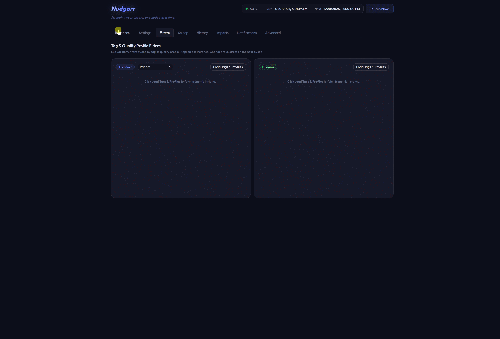

# Nudgarr
### Because RSS sometimes needs a nudge.

Nudgarr keeps your Radarr and Sonarr libraries improving automatically, scheduling searches for missing content and quality upgrades so you don't have to.

---

## UI

Nudgarr includes a full web UI accessible from any browser on your network. No separate app required — just navigate to `http://your-host:8085` after setup.



The interface covers everything in one place: instance management, sweep status and history, confirmed imports with quality upgrade tracking, exclusions, notifications, and per-instance configuration. On mobile, a purpose-built layout activates automatically in portrait and landscape.

---

## Documentation

Full documentation is available on the [Nudgarr Wiki](https://github.com/MMagTech/nudgarr/wiki), including:

- [Setup & Configuration](https://github.com/MMagTech/nudgarr/wiki/Setup-&-Configuration)
- [How Nudgarr Works](https://github.com/MMagTech/nudgarr/wiki/How-Nudgarr-Works)
- [Settings Reference](https://github.com/MMagTech/nudgarr/wiki/Settings-Reference)
- [Per-Instance Overrides](https://github.com/MMagTech/nudgarr/wiki/Per-Instance-Overrides)
- [Tag & Quality Profile Filters](https://github.com/MMagTech/nudgarr/wiki/Filters)
- [Radarr & Sonarr Backlog](https://github.com/MMagTech/nudgarr/wiki/Radarr-and-Sonarr-Backlog)
- [Exclusions](https://github.com/MMagTech/nudgarr/wiki/Exclusions)
- [Notifications (Apprise)](https://github.com/MMagTech/nudgarr/wiki/Notifications-(Apprise))
- [FAQ & Troubleshooting](https://github.com/MMagTech/nudgarr/wiki/FAQ-&-Troubleshooting)
- [Glossary](https://github.com/MMagTech/nudgarr/wiki/Glossary)

---

## What it does

- **Cutoff Unmet sweeps** — finds items in Radarr and Sonarr's Wanted Cutoff Unmet queue and triggers a search for a better quality version
- **Backlog Nudges** — searches missing movies and episodes that have never been grabbed, with age filtering, grace period, and per-app caps
- **Skip Queued** — items already downloading are silently skipped; queued items never consume a search slot
- **Import tracking** — polls Radarr and Sonarr after each sweep to confirm which searches resulted in a successful download
- **Multiple instances** — supports multiple Radarr and Sonarr instances independently, each with their own health status

---

## Features

**Core**
- Cron-based scheduler with configurable expression and timezone support, or manual-only mode
- Skip Queued — items already in the download queue are silently bypassed; max per run always filled from actionable items
- Per-instance enable/disable — disabled instances skipped in sweeps and health checks
- Per-app sample modes — Random, Alphabetical, Oldest Added, Newest Added independently for Radarr and Sonarr
- Configurable cooldown, batch size, sleep, and jitter controls for indexer rate limit compliance
- Per-app Backlog Nudge toggles with Missing Added Days age filter and per-instance caps
- Radarr minimumAvailability filter — movies that haven't reached their availability threshold are automatically skipped

**UI**
- Web UI with Instances, Sweep, Settings, Filters, History, Imports, Intel, Notifications, Advanced, and Overrides tabs
- Sticky header — wordmark, status bar, and tab bar pin to the top of the viewport on all tabs; tab content scrolls beneath
- Intel tab — lifetime performance dashboard showing Library Score, Search Health, Instance Performance, Stuck Items, Exclusion Intel, Library Age vs Success, Quality Iteration, and Sweep Efficiency
- Search history with sweep type, instance, library added date, search count, sortable columns, and title search
- Clickable titles in History and Imports — opens the item directly in the configured Radarr or Sonarr instance
- Exclusion list — exclude specific titles from future searches via the ⊘ icon in History
- Auto-exclusion — titles searched N times with no confirmed import are automatically excluded; configurable threshold per app (Radarr/Sonarr); auto-unexclude after X days returns them to eligibility
- Confirmed import tracking with lifetime Movies/Episodes totals, period toggle (Lifetime / Last 30 Days / Last 7 Days), type filtering, title search, and quality upgrade history per item
- Apprise notifications — sweep complete, import confirmed, auto-exclusion, and error triggers per instance
- Configurable log level (DEBUG / INFO / WARNING / ERROR) set live from the Advanced tab with no container restart
- Diagnostic download includes the last 250 lines of `nudgarr.log` with URLs masked — useful for sharing with the community when troubleshooting
- First-run onboarding walkthrough and What's New modal on upgrade

**Mobile**
- Purpose-built layout for devices under 500px wide — activates automatically, no separate app or URL
- Four-tab bottom nav: Home · Sweep · History · Settings
- History tab includes inner tabs for History, Add from History, and Exclusions
- Settings tab — adjust Cooldown, Cutoff Max, Sample Mode, Notifications, and Per-Instance Overrides without leaving mobile
- Landscape mode — rotating to landscape opens Backlog, Execution, Overrides, and Filters tabs with full stepper controls
- Bottom sheets for Imports with haptic feedback and swipe-to-dismiss
- iOS and Android browser toolbar matches the app via `theme-color`

---

## Power user features

Nudgarr works out of the box with sensible defaults. If you're running a more advanced setup — multiple Radarr or Sonarr instances, separate 4K and 1080p libraries, different cooldown strategies per server, or just want tighter control — these features are worth knowing about.

**Auto-Exclusion** — titles searched N times with no confirmed import are automatically excluded. Configure separate thresholds for Radarr and Sonarr in Advanced. Auto-unexclude after X days returns titles to eligibility so releases that eventually appear on indexers get another chance. The status bar badge on desktop and the notification row on mobile surface new auto-exclusions without requiring you to dig through the Exclusions tab.

**Tag & Quality Profile Filters** — exclude items from sweep by tag or quality profile, configured per instance. Items matching an excluded tag or profile are skipped before cooldown runs and never consume a search slot. Load tags and profiles live from each instance in the Filters tab.

**Per-Instance Overrides** — seven fields can be tuned independently per instance: cooldown, max cutoff unmet, max backlog, max missing days, sample mode, backlog enabled, and notifications enabled. Unset fields inherit the global value. Enable in Advanced → configure in the Overrides tab. [Full details →](https://github.com/MMagTech/nudgarr/wiki/Per-Instance-Overrides)

**Sample modes** — control how items are selected for each sweep. Random keeps indexers guessing; Alphabetical and Oldest/Newest Added let you work through your library systematically. Set globally or per-instance.

**Backlog Nudges** — separate from cutoff unmet sweeps, backlog nudges target items that have never been grabbed. The Missing Added Days filter excludes newly added items so you're only nudging things that have been sitting for a while. The Grace Period filter delays the first search until indexers have had time to populate after a release. Configured independently for Radarr and Sonarr.

**Exclusions** — click the ⊘ icon on any History row to permanently exclude a title from future searches. Exclusions are global across all instances. Manage the full list in the Sweep tab.

**Cooldown** — prevents re-searching the same item too frequently. Default is 48 hours. Lower it on high-frequency setups; raise it if you want to be gentler on indexers.

**Import tracking** — after each sweep, Nudgarr polls Radarr and Sonarr history to confirm which searches resulted in a successful download. Results appear in the Imports tab with turnaround times and lifetime totals.

For a full walkthrough of all settings see the [Settings Reference](https://github.com/MMagTech/nudgarr/wiki/Settings-Reference) on the wiki.

---

## Per-Instance Overrides

The default global settings work great for typical setups with one Radarr and one Sonarr. If you are an Arr-tist running multiple instances — separate 4K and 1080p libraries, different servers, different cooldown strategies — Per-Instance Overrides lets you fine-tune seven fields independently for each one.

| Field | What it controls |
|-------|-----------------|
| Cooldown Hours | How long before an item is eligible for re-search on this instance |
| Max Cutoff Unmet | How many cutoff unmet items are searched per run |
| Max Backlog | How many missing items are searched per run |
| Max Missing Days | Age filter for backlog searches (Radarr only) |
| Grace Period (Hours) | Hours to wait after availability date before first missing search |
| Sample Mode | How cutoff unmet items are picked for this instance |
| Backlog Sample Mode | How missing items are picked for this instance |
| Backlog Enabled | Whether backlog searches run for this instance |
| Notifications Enabled | Whether notifications fire for this instance |

Unset fields inherit the global value automatically. Enable in Advanced and configure in the Overrides tab on desktop, or rotate to landscape on mobile.

See the [Per-Instance Overrides](https://github.com/MMagTech/nudgarr/wiki/Per-Instance-Overrides) wiki page for full details.

---

## Quick start

Images are available on **Docker Hub** and **GitHub Container Registry (GHCR)**.

| Registry | Image |
|----------|-------|
| Docker Hub | `mmagtech/nudgarr:latest` |
| GHCR | `ghcr.io/mmagtech/nudgarr:latest` |

**Tags:** `latest` · `v4.1.0` · `4.1.0` · `4.1` · `v4.0.0` · `4.0.0` · `4.0`

1. Copy `.env.example` to `.env` and fill in your values
2. Run `docker compose up -d`
3. Open `http://<your-host>:8085`

```env
PUID=1000
PGID=1000
PORT=8085
CONFIG_PATH=/your/path/to/appdata/nudgarr
TZ=UTC
# SECRET_KEY=your-secret-key  # optional, auto-generated if not set
```

A ready-to-use `docker-compose.yml` is included in the repo root. Copy it alongside a `.env` file — see `.env.example` for all available options.

---

## PUID / PGID

Nudgarr runs as the user you specify — no permission issues with your `/config` volume.

| Platform | Typical values |
|----------|---------------|
| Unraid | `PUID=99` `PGID=100` (nobody:users) |
| Linux | `PUID=1000` `PGID=1000` |
| Synology | Match your DSM user — check with `id` over SSH |

Defaults to `1000:1000` if not set.

---

## Data files

| File | Purpose |
|------|---------|
| `/config/nudgarr-config.json` | All settings |
| `/config/nudgarr.db` | SQLite database — history, stats, exclusions, and app state |
| `/config/logs/nudgarr.log` | Rotating log file — 5 MB per file, 3 backups. Log level set in Advanced tab. |

---

## Security

Nudgarr is a local network tool. The login screen provides basic access control — it is not a hardened security layer. Passwords use PBKDF2-HMAC-SHA256 with a unique random salt, and failed attempts trigger a progressive lockout.

Run on your LAN only. For remote access use a VPN (Tailscale, WireGuard) or a reverse proxy with HTTPS. Do not expose port 8085 to the internet.

---

## Upgrade notes

**v4.2.0** — Intel tab, sticky header, exclusion event tracking, protected aggregate, backlog sample mode split, maintenance window, grace period, and missing max 0 = all eligible. No config changes required. Pull the new image and restart. Migration v10 runs automatically on first start — adds `exclusion_events` and `intel_aggregate` tables. Existing data is fully preserved. Intel data begins accumulating immediately from the first sweep after upgrade. Two new config keys (`radarr_missing_grace_hours`, `sonarr_missing_grace_hours`) default to 0 — no action needed.

**v4.1.0** — Auto-exclusion, mobile auto-exclusion, import stats period toggle, logging improvements, and a full code quality refactor. No config changes required. Pull the new image and restart. Migration v9 runs automatically on first start — adds `source`, `search_count`, and `acknowledged` columns to the exclusions table. Existing exclusions are preserved and default to `source=manual`. From this version onwards, static assets include version query strings — browsers automatically receive fresh JS and CSS after a container upgrade without requiring a hard refresh.

**v4.0.0** — Foundations release. No config changes required, no data migration needed. Pull the new image and restart. v4.0.0 removes the v1–v6 migration chain and resets the migration baseline. Two post-reset migrations are included: v7 adds the `series_id` column to `search_history`, and v8 adds quality upgrade tracking. If you are upgrading directly from v3.1.x or earlier, upgrade to v3.2.0 first.

**v3.2.0** — No config changes required. Per-Instance Overrides is off by default — enable in Advanced if you want to use it.

**v3.1.0** — All data (history, stats, exclusions) moves to a SQLite database. Existing JSON files migrate automatically on first start — no action needed. See the Data files section above for details.

**v3.0.0** — No config changes required. The mobile layout activates automatically on devices under 500px wide.

For full version history see [CHANGELOG.md](CHANGELOG.md).

---

## Contributing

See [CONTRIBUTING.md](CONTRIBUTING.md) for project structure and development guide. For usage questions, the [wiki](https://github.com/MMagTech/nudgarr/wiki) is the first stop.

## Community

Join the community on Reddit at [r/nudgarr](https://www.reddit.com/r/nudgarr) — share configs, ask questions, and follow development updates.
